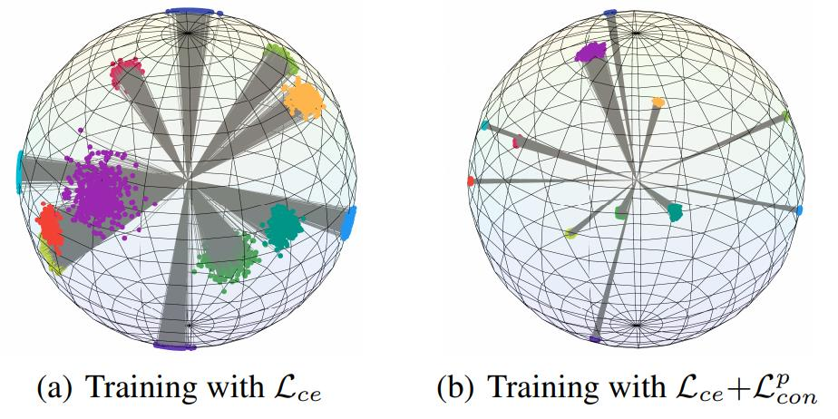

# Visualization of Prototypes

This sub-repository provides the visualization of generated *feature prototypes* by the generator trained with different losses, i.e., cross-entropy loss and contrastive loss. 
([Source-free Domain Adaptation via Avatar Prototype Generation and Adaptation](https://arxiv.org/abs/2106.15326)[CPGA])

# Getting Started
- First, to obtain the source-trained model and the generators trained with different losses:
```
python train_source.py --gpu 0 --data_path ./dataset/VISDA-C/train --label_file ./data/visda_synthesis_9_1_split.pkl
python train_generator.py --gpu 0 --ce_warm_epoch 1000 --max_epoch 1000 --source_model YOUR_MODEL_ROOT  # only cross-entropy loss
python train_generator.py --gpu 0 --ce_warm_epoch 100 --max_epoch 1000 --source_model YOUR_MODEL_ROOT  # cross-entropy loss & contrastive loss
```

- Second, to get the embeddings:
```
python get_embeddings.py --gpu 0 --source_model YOUR_MODEL_ROOT --ce_generator CE_GENERATOR --contras_generator CONTRAS_GENERATOR  # get the ce_embeds and embeds
```
- Finally, load the embeddings and visualize them with Matlab:
```
>> visual(ce_embeds,labels)  # cross-entropy loss
>> visual(embeds,labels)  # cross-entropy loss & contrastive loss
```



# For your own visualizations
- Train an additional linear layer:
```
net.vis_fc = nn.Linear(feature_dim, 3).cuda()  # for the visualization
net.class_fc = nn.Linear(3, class_nums).cuda()  # for the classification
```

- After training, get the three-dimensional embeddings of the input **x**:
```
features = net(x)  # get the features
embeddings = net.vis_fc(features)  # get the embeddings

save_points(embeddings.detach().cpu().numpy(), labels)  # save the embeddings
```

- Finally, load the data and visualize them with Matlab:
```
>> visual(ce_embeds,labels)
>> visual(embeds,labels)
```


# Citation
If you find our work useful in your research, please cite the following paper:
```
@inproceedings{Qiu2021CPGA,
  title={Source-free Domain Adaptation via Avatar Prototype Generation and Adaptation},
  author={Zhen Qiu and Yifan Zhang and Hongbin Lin and Shuaicheng Niu and Yanxia Liu and Qing Du and Mingkui Tan},
  booktitle={International Joint Conference on Artificial Intelligence},
  year={2021}
}
```

# Contact
For any question, please file an issue or contact
```
Zhen Qiu: seqiuzhen@mail.scut.edu.cn
Hongbin Lin: sehongbinlin@mail.scut.edu.cn
```